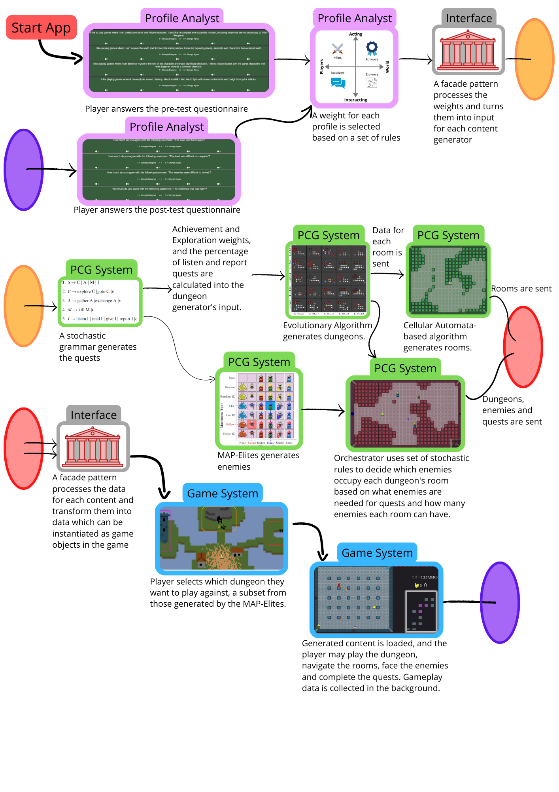

<h1 align="center">
Welcome!
</h1>
----------

  <figcaption align = "center"><b>Undertale</b></figcaption>

I'm Leonardo, a Brazilian PhD on Computer Science, with a thesis on realtime procedural generation of multiple contents for games, and former associate professor in Computer Sciences, both at [Instituto de Ciências Matemáticas e de Computação](https://www.icmc.usp.br/en/) from [Universidade de São Paulo](https://www.topuniversities.com/universities/universidade-de-sao-paulo), in Brazil.

I'm also an [indie game developer](https://leotpereira.itch.io/) in my spare time (at least when I'm not playing games, watching animes or reading). Besides programming, I usually take care of pixel art, game design, and writing.

I have been programming since my first year as an undergraduate, in 2012, when I also started developing games together with the [Fellowship of the Game](https://fog-icmc.itch.io/)
group from ICMC-USP and some friends. I began researching on procedural content generation, AI in games and other game-related topics in 2013,
which motivated me to pursue my [Master's degree](https://teses.usp.br/teses/disponiveis/55/55134/tde-25032019-144917/en.php) and my PhD.

I'll talk a little about me on this site, in case somebody may be interested &#128512;

## Research Projects

By the beginning of 2023, I have already published with my colleagues 15 papers. 4 on international journals, 7 full papers on conferences, 3 short papers and 1 paper in a national journal. I've also been an advisor for the final paper of 5 undergraduates.

My main line of research is Procedural Content Generation for games. More specifically, the generation of multiple creative facets and how to adapt them to different types of players. However, I like to research and advise students in other game-related areas, like the generation of adaptive AI in games and serious games. I'll present a summary of my researches:

I've started researching on Evolutionary Algorithms (EAs) applied to path-planing in robots with my advisor [Claudio Toledo](https://scholar.google.com.br/citations?user=oiW7E1IAAAAJ&hl=en), but a few months later had the opportunity to start working on [EAs applied to the generation of scripts in Bos Wars](https://dl.acm.org/doi/10.1145/2598394.2598489), a Real-Time Strategy (RTS) game, from the likes of StarCraft, developed in C++ with a Java interface for injecting code.

Shortly after, I worked with Claudio's masters student (at the time) [Lucas Ferreira](http://www.lucasnferreira.com/) in [generating procedural levels with enemy and item placement in a Super Mario Bros clone](https://dl.acm.org/doi/10.1145/2598394.2598489) in Java, also using EAs.

Then, for my final paper in the undergraduate course, I studied Machine Learning (ML) approaches to learn to classify levels from an Angry Birds clone (developed by Lucas as his [Master Thesis](https://ieeexplore.ieee.org/document/8082517)) as feasible or not, and [reduce the simulation time of the EA that generated the levels procedurally by skipping simulation of levels classified as unfeasible](https://www.worldscientific.com/doi/abs/10.1142/S0218213017600193).

I started my masters' studies in 2017, creating an [EA to evolve dungeons with locked-door missions for 2D Zelda-like games](https://www.sciencedirect.com/science/article/abs/pii/S0957417421004504).

In 2019, I started my PhD studies, focused on the orchestration of the generation of multiple game contents and the adaptation for different player profiles. We've developed an [EA able to evolve enemies for 2D Zelda-like games](https://ieeexplore.ieee.org/document/9637547/) and many updates for our game, as well as improvements on the dungeon generation and other contents, like the [realtime generation of dungeons, enemies and quests](https://ieeexplore.ieee.org/document/9917383/).

The following figure shows the workflow of the application from my PhD: the player answers a short questionnaire, and the system process this data to calculate their preferences. Them, another system receives this data and creates the quests, using a stochastic grammar. These quests, together with the profile, will determine the size, linearity and number of locks and keys for the dungeon, created through an evolutionary algorithm. Also, the quests and profile will influence the enemies, generated through a MAP-Elites algorithm. Another algorithm, based on Cellular Automata, generates each room of the dungeon. Finally, an orchestrator uses a set of stochastic rules to decide which enemies occupy each room in the dungeon. After all the generation is done, the content is passed to the game itself, in Unity. After playing, other contents may be created according to the player's feedback.

  <figcaption align = "center"><b>Workflow of my PhD project's application.</b></figcaption>

The project's code, that is a continuation of my masters', is public in [GitHub](https://github.com/LeonardoTPereira/Overlord-Project).

During that period of my PhD, I've also acted as an advisor for the final paper of 5 undergrad students, and co-advisor of another one. One turned into a conference paper, about the [adaptive generation of characters for tabletop role playing games](https://ieeexplore.ieee.org/document/8924830/).

All my publications are in my [Research Gate](https://www.researchgate.net/profile/Leonardo-Pereira-9) and my [CV Lattes](http://lattes.cnpq.br/5875419968824213) (our CV for researchers in Brazil). Email me or send me a message if you want to ask about any of the researches &#128512;

## Game Development Projects

I've developed 16 games, 5 of them during the Global Game Jam, 4 from other game jams, and 3 for research purposes. Of those last three, one is the testbed for my master and PhD experiments, which can be played [here](https://overlord-1b095.web.app/). The other 4 are projects developed with the Fellowship of the Game group from ICMC-USP's University, developed mostly on our free time and weekends.

You can check most of my games in [itch.io](https://leotpereira.itch.io/), where the link to their respectives' GitHub are present, since all are open source. For some of the oldest ones from the GGJ, there is my [GGJ profile](https://globalgamejam.org/users/leonardo-pereira).

My most important game is [Final Inferno](https://fog-icmc.itch.io/final-inferno), a 2D JRPG-inspired game developed in Unity. I was the creator of the game's idea, as well as the game designer, focusing on the mechanics and economy. I've also made a good part of the skills' animations and icons, most of the tech-artist tasks, programmed some minor tasks and helped define and implement the project's devops on [GitHub](https://github.com/FellowshipOfTheGame/FinalInferno). Although some members have left, and all of us are occupied with our jobs, we still keep the game alive, and will soon publish the second chapter of the adventure, with new enemies, scenarios, bosses, skills, and missions.

  <figcaption align = "center"><b>Final Inferno's battle screen.</b></figcaption>

Another project that is very dear to me is [Sick Love](https://fog-icmc.itch.io/sick-love), a Visual Novel developed with Ren'py. I was in charge of half the game programming and half of the scripts and dialogues, as well as involved in many design decisions.

  <figcaption align = "center"><b>Final Inferno's battle screen.</b></figcaption>

## Technologies, Tools and Languages

I mostly focus on developing games and my procedural content generation algorithms using Unity and the C# language. However, I have already used different programming languages and tools through my career. Here I'll list all of which I can remember.

I am very interested in studying and developing applications that have good coding practices, patterns and design. Therefore, I have been dedicating my recent years to studying Clean Code, Design Patterns, Software Architecture, Refactoring, DevOps, and other good development and operation practices.

I believe that good code matters and, more than that, I believe that to achieve the orchestration of multiple procedurally generated content, in a way that they can adapt to different players and make it viable to use in games, we need to be the best developers as possible.

The lists below summarize the topics I've learned and practiced throughout my time as an undergraduate and graduate student, be it in courses, working in student groups, personal projects, my research group and while teaching.

### Programming Languages

The following table summarizes my knowledge in programming languages, using the following labels:
 
Basic () - I've had some contact and practice with.
 
Good () - I've got a good understanding and some practice.
 
Excellent () - I've got an excellent understanding and many years of practice.

| Basic | Good | Excellent |
|-----|----|---------|
|     JavaScript   |    C++   |      C#     |
|     HTML   |    Python   |      Java     |
|     CSS   |    R   |      C      |
|     Dart   |    Lua   |           |
|       |    SQL   |           |

### Tools and Technologies

The following table summarizes my knowledge with tools and technologies, using the following labels:
 
Basic () - I've had some contact and practice with.
 
Good () - I've got a good understanding and some practice.
 
Excellent () - I've got an excellent understanding and many years of practice.

| Basic | Good | Excellent |
|-----|----|---------|
|     Blender   |    GameMaker Studio 2   |      Unity     |
|     Stencyl   |    GitHub Actions   |      Git     |
|     Postgres   |    Krita   |      Aseprite      |
|     UML   |    Renpy   |      Spreadsheets      |
|     C4   |    V-Rep   |      Presentation tools      |
|       |     OpenCV   |    Latex    |
|       |     Linux   |       |

### Knowledge, Experience and Skills

The following table summarizes my knowledge, experience and skills with different areas, using the following labels:
 
Good () - I've got a good understanding and some practice.
 
Excellent () - I've got an excellent understanding and many years of practice.

| Good | Excellent |
|----|---------|
|    Software Architecture  |    Game Development   |
|    DevOps  |    Game Programming   |
|    Design Patterns  |    Game Design   |
|    Machine Learning  |    Clean Code   |
|    Pixel Art  |    OO Programming  |
|    Gamefication  |    Structured Programming   |
|    Serious Games  |    Component-Oriented Programming |
|    Game Marketing  |    Writing scientific papers  |
|    Game Industry  |    Modeling scientific experiments |
|    Autonomous Robots  |    Data Collection |
|    Digital image processing  |    Data Processing |
|    Recommender systems  |    Data Analysis |
|    Human-Computer Interface  |    Data Visualization |
|    Acessibility |    Problem Solving |
|    Relational databases  |    Data modeling |
|    Brain-Computer Interface  |    Leading teams |
|    3D modeling  |    Team work |
|    Shader Graph  |    Teaching |
|    Animations  |    Communication |
|    Particles  |    Organizing Events |
|    Narrative writing  |    Evolutionary Algorithms |

### Languages

- I am a native Portuguese speaker 
- I am fluent in English  and Spanish 
- I have limited working proficiency in French 
- I have elementary proficiency in Italian , and Japanese 

## Teaching and University Stuff

I have been an associate professor in Computer Sciences at [Instituto de Ciências Matemáticas e de Computação](https://www.icmc.usp.br/en/) from [Universidade de São Paulo](https://www.topuniversities.com/universities/universidade-de-sao-paulo), in Brazil for 3 years (2020 to 2022). During this period, I lectured disciplines like introduction to computer science (basic algorithms and introduction to C), algorithms and data structures (lists, trees, b-trees, primary indexes, etc.), object oriented programming, and others. I have received excellent feedback from both my colleagues and students, having received 2 awards in 2021 as the best professor of the Information System's course. Some students gave their feedbacks to our departments coordination saying that I was "*one of the best professors they have ever had at USP*", which made me very happy.

## More About Me

I love videogames, anime, light novels, game development, and learning new stuff.

Most of my favorite games nowadays are indies, but I also love most of the Nintendo games and japanase-developed games.
Some of the games I love are: Final Fantasy IX (and all the ones before), Mega Man X (1 through 6), The Legend of Zelda: A Link to the Past (and almost every other Zelda), Arc the Lad Trilogy, Donkey Kong Country Trilogy, Undertale, Hades, The Binding of Isaac, Stardew Valley, Persona 5, PayDay 2, Risk of Rain (1 and 2), Zero Escape Trilogy, The Void Rains Upon Her Heart, and many others.

Some of my favorite anime/manga/light novels are Re:zero, Konosuba, Overlord, Boku no Hero Academia, Tengen Toppa Gurren Lagann, One Piece, Slayers, Hellsing Ultimate, Code Geass, Hunter X Hunter, Jojo no Kimyou na Bouken, Danganronpa, Kiseijuu, Psycho-Pass, Danmachi, Mob Psycho 100, Kaguya-sama, Bleach, Mushoku Tensei, and many more.

-Under Construction-
